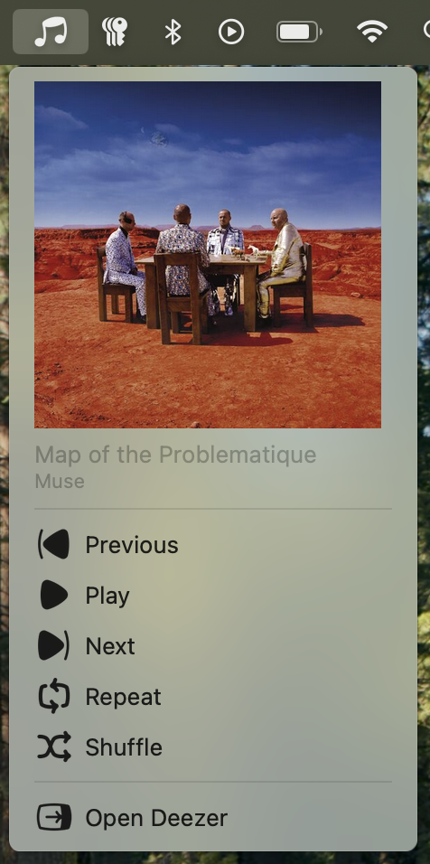

# Deezer Menubar Control

A macOS menubar application that allows you to control Deezer playback without needing to open the main Deezer browser window or application.

<p align="center">
    
</p>

_(Caption: Main view of the application in the menubar)_

## Features

- Displays the current track title, artist, and album artwork.
- Playback controls:
  - Play / Pause
  - Next track
  - Previous track
  - Repeat
  - Shuffle
- Quickly open the Deezer page.
- Automatic track information updates.

## Screenshots

### Main Menu

<!-- SCREENSHOT_MENU_TRACK_INFO -->

_(Caption: Display of track information and cover art)_

### Playback Controls

<!-- SCREENSHOT_MENU_CONTROLS -->

_(Caption: Playback control options)_

### Deezer Window (if applicable)

<!-- SCREENSHOT_DEEZER_WINDOW_HIDDEN -->

_(Caption: The Deezer window can be hidden for a discrete experience)_

## Installation

### Prerequisites

- Node.js and npm (or Yarn)
- macOS

### Steps

1.  Clone the repository:
    ```bash
    git clone https://github.com/Clem-0000/deezer-mac-popup-controller.git
    cd deezer-mac-popup-controller
    ```
2.  Install dependencies:
    ```bash
    npm install
    # or
    # yarn install
    ```
3.  Build the application:
    To create a distributable application (e.g., a `.dmg` file on macOS), run:
    ```bash
    npm run build
    ```
    This will compile the TypeScript code and then use `electron-builder` to package the application. The output will typically be in a `dist` folder.

## Usage

### Development

1.  Launch the application in development mode:
    ```bash
    npm start
    # or
    # yarn start
    ```
    This command will first build the project and then launch Electron. A Deezer icon will appear in your menubar. Click on it to display the current track information and playback controls.
    If this is your first time using the app, you may need to open the full Deezer page loaded by the app and enter your credentials.

### Production (Using the Built Application)

1.  After running `npm run build` (see Installation steps), navigate to the `dist` folder (or the specified output directory).
2.  You will find the packaged application (e.g., `Deezer Menubar.dmg` on macOS).
3.  **On macOS:**
    - Open the `.dmg` file.
    - Drag the `Deezer Menubar.app` icon to your `Applications` folder.
    - Launch the application from your `Applications` folder.
      The Deezer icon will appear in your menubar.

## Technologies Used

- [Electron](https://www.electronjs.org/)
- [TypeScript](https://www.typescriptlang.org/)
- Node.js
- Deezer Web Player (via light scraping)

## Acknowledgements

- Icon by [Icons8](https://icons8.com/icons/)
